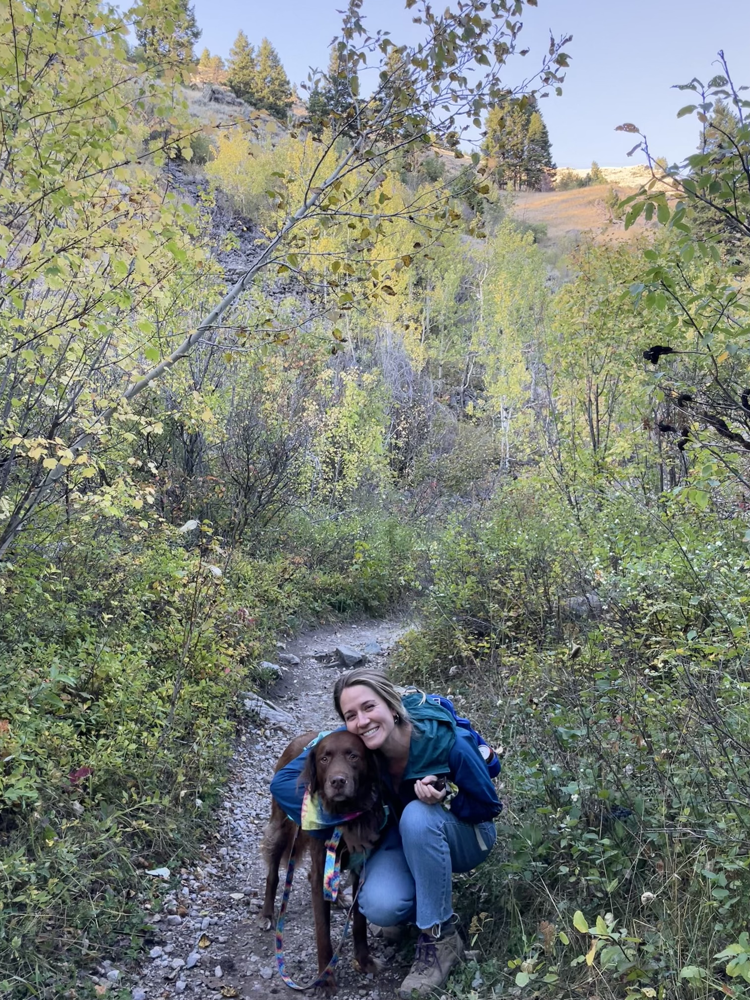

# Hi, I'm Katie!

  

I'm a microbiology PhD student and [NSF Extreme Biofilms](https://www.montana.edu/biofilm/) National Research Trainee at Montana State University. My research investigates applications of cold-adapted bacterial isolates for **biocementation in permafrost** — exploring whether microbes can stabilize infrastructure in thawing Arctic environments.

Before grad school, I spent three years with the [NASA DEVELOP National Program](https://appliedsciences.nasa.gov/what-we-do/capacity-building/develop), where I designed and managed research projects applying NASA Earth observations to environmental management decisions. I've collaborated with federal, academic, and non-profit organizations on projects ranging from Venus flytrap habitat modeling to wildfire severity monitoring.

## Connect

For more about my work, visit my [website](https://katie-caruso.github.io). You can also explore my [research methods](https://katie-caruso.github.io/methods/) to see protocols and computational notebooks from my current projects.

Reach me at [caruso.k.e@gmail.com](mailto:caruso.k.e@gmail.com)
